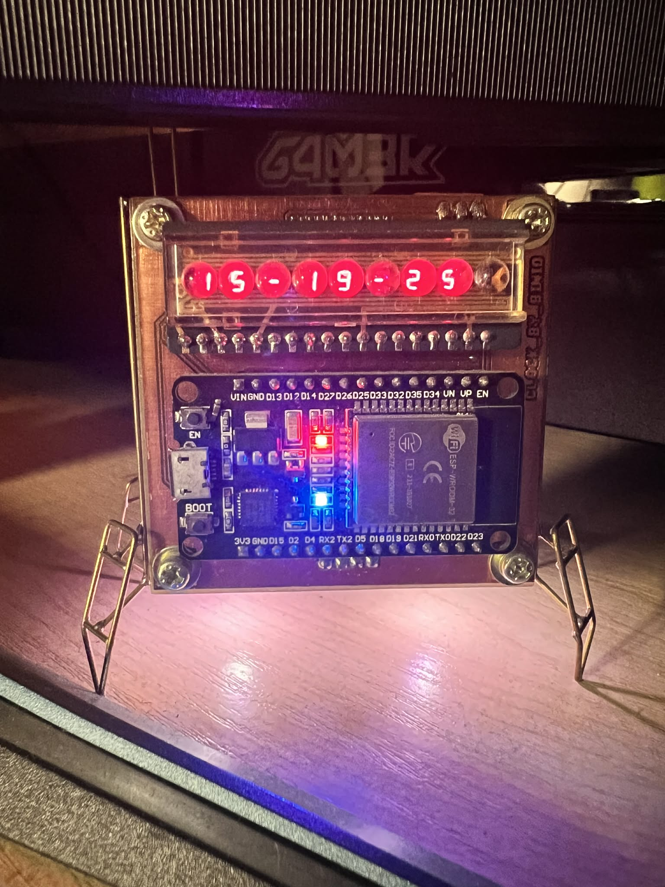

# Desk Satellite Clock (ESP32)

A PlatformIO/Arduino project for a custom desk clock shaped like a small satellite.
The device runs on an ESP32 and a custom PCB milled on a CNC 3018.



It provides:
- Time and date from NTP on MAX7219 display
- Temperature and humidity from DHT11
- Two NeoPixels at the bottom (rocket-engine style effect)
- One top LED "antenna" blink (satellite beacon effect)
- Vintage clock-style 7-segment LED module with lens look (9 digits total, last digit intentionally unused)

## Author
- **Binkosss**

## Project Goal
Build a reliable, visually distinctive desk clock that combines practical data (time/date/environment) with a satellite-inspired LED identity.

## Design Story
Desk Satellite Clock is an ESP32-based desktop device built on a custom CNC 3018 milled PCB.
It combines NTP time/date on a MAX7219-driven vintage 9-digit 7-segment module (last digit intentionally unused),
DHT11 environmental sensing, and FreeRTOS-separated display/animation tasks.

## Features
- Dual FreeRTOS tasks (display + LED animation)
- Button-based mode switching (time/date/temp+humidity)
- Smooth NeoPixel color transition
- NTP sync over Wi-Fi

## Repository Structure
- `src/main.cpp` – main application code
- `include/secrets.h.example` – Wi-Fi credentials template
- `lib/` – local third-party libraries
- `docs/photos/` – project photos (build progress, final device, PCB shots)
- `hardware/pcb/fusion360/` – Fusion Electronics design sources (`.fsch` and `.fbrd`)
- `hardware/pcb/gerbers/` – manufacturing output files for PCB fabrication
- `hardware/pcb/exports/` – PDF/image exports and assembly-related outputs
- `CHANGELOG.md` – release and change history

## Quick Start
### 1) Configure Wi-Fi secrets
1. Copy `include/secrets.h.example` to `include/secrets.h`
2. Set your credentials:

```cpp
#define WIFI_SSID "YOUR_WIFI_SSID"
#define WIFI_PASSWORD "YOUR_WIFI_PASSWORD"
#define TIMEZONE_POSIX "CET-1CEST,M3.5.0/2,M10.5.0/3"
```

`include/secrets.h` is ignored by Git.

`TIMEZONE_POSIX` enables automatic standard time / daylight saving time switching.
Examples:
- Poland: `CET-1CEST,M3.5.0/2,M10.5.0/3`
- New York: `EST5EDT,M3.2.0/2,M11.1.0/2`
- UTC (no DST): `UTC0`

### 2) Build
```bash
pio run
```

### 3) Upload
```bash
pio run -t upload
```

### 4) Serial monitor
```bash
pio device monitor -b 115200
```

## Hardware (used in code)
- ESP32 DevKit V1
- Vintage lens-style 9-digit 7-segment LED display module (MAX7219-driven; last digit intentionally unused)
- DHT11 on GPIO 15
- Button on GPIO 13 (`INPUT_PULLUP`)
- Single LED on GPIO 18
- NeoPixel data on GPIO 5
- MAX7219 display module

## Hardware Design Files
- PCB design sources are stored in `hardware/pcb/fusion360/`.
- Fusion Electronics files include schematic (`*.fsch`) and board (`*.fbrd`) files.
- Project and build photos are stored in `docs/photos/`.

## Notes
- Timezone is configured by `TIMEZONE_POSIX` in `include/secrets.h`.
- The clock uses POSIX timezone rules, so DST/standard time switching is automatic.
- For public sharing, do not commit `include/secrets.h`.

## License
MIT — see `LICENSE`.
